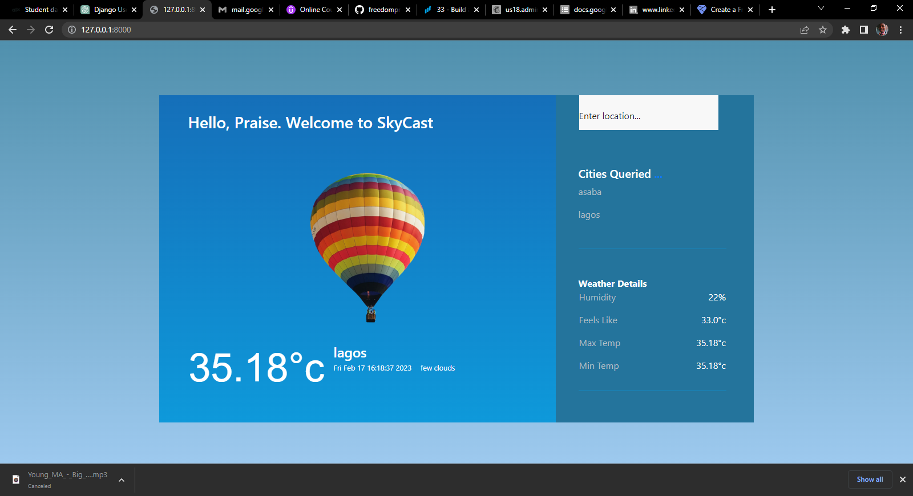

# SkyCast



This is a Django web application that allows users to compare weather information for different cities, view historic weather data, and sign up for daily weather alerts.

## Features
- Compare current weather data for multiple cities
- View historic weather data for each city
- Sign up to receive daily weather updates by email
- Sleek and Responsive design
- Save a log of previously queried cities
- Data sourced from OpenWeatherMap API
- Dark Mode Options

## Installation

**1. Clone the repository**
```sh
git clone https://github.com/freedompraise/skycast.git
```

**2. Create a virtual environment and activate it:**
```sh
python3 -m venv env
source env/bin/activate
```

**3. Install the required packages**
```sh
pip install requirements.txt
```
**4. Create a 'config.ini' file in the 'weathercompare' directory with your OpenWeatherMap API key and email credentials:**
```sh
[openweathermap]
api_key = your_api_key

[email]
server = your_email_server
port = your_email_port
username = your_email_username
password = your_email_password
```

**5. Run the Django server:**
```sh
python manage.py runserver
```

# Usage
- Navigate to the Weather Compare App in your web browser: http://localhost:8000
- Sign up for daily weather alerts by entering your location and email address on the signup page
- Compare weather data for different cities by entering their names in the search bar
- View historic weather data for a city by clicking on the city's name in the search results
Credits

# Credits
This app was created by Praise Freedom Dike for the <a href = "http://CodeChalleng.es/challenges/33">Weather Compare App challenge.</a>

Follow me on [Twitter](https://twitter.com/freedom_praise)

Connect with me on [Linkedin](https://linkedin.com/praise-dike-7a25011b3)

# License
This project is licensed under the <a href="https://opensource.org/licenses/MIT">MIT LICENSE</a>
